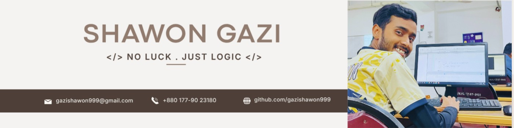

<h1 align="center">Hi 👋, I'm SHAWON GAZI</h1>
 <h3 align="center">Full Stack Web Developer (Learning)</h3>
 
 <ul align= "center">
 <!--- typo --->
    
  </ul>

- 👋 Hi, I’m **[@gazishawon999](https://github.com/gazishawon999)**

- 📝 I regularly write articles on **[LinkedIn](https://linkedin.com/in/gazishawon999)**

- 💬 Ask me about **C, Java , Algorithm, JavaScript, TypeScript, Database(MySQL)**

- 📩 Email Me **gazishawon999@gmail.com**

- 🌐 Explore My [Resume](https://drive.google.com/file/d/118NdPHholDLXVwkTJ1uunpJEw1Q7ajU6/view?usp=sharing)

- ⚡ Fun fact **I think I am Curious.**

<h3 align="left">Connect with me:</h3>

 
<!--- technology --->
##  <b> TECHNOLOGY STACK:</b>

### Languages:

### CSS Frameworks & Libraries:

### JavaScript Frameworks & Libraries:

### Database & Model:

### Deployment Platform:

### Design & Graphics:

### Tools & Technologies:

 

<!--- statistics --->

## <b> GITHUB STATISTICS & ANALYSIS:</b>

### GitHub Contributions:

### GitHub Statistics:

|  |  |
| -------------------------------------------------------------------------------------------------------------------------------------------------------------------------------- | ---------------------------------------------------------------------------------------------------------------------------------------------------------------------------------------------------------- |

### Repository Stats & Streak:

|  |  |
| ------------------------------------------------------------------------------------------------------------------------------------------------------------------------------------- | ---------------------------------------------------------------------------------------- |

 
